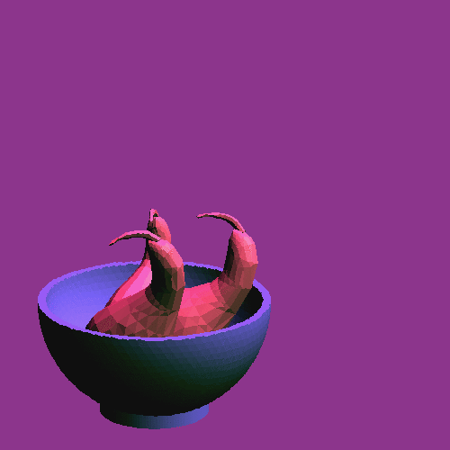

# Computer Graphics Final Project: Ela Gulsen
 * Semester-long project for the Stuyvesant computer graphics class; results in a graphics engine which is able to generate 3D images and provide color, shading, and animation.
 * Upon `make`-ing, produces a GIF of fruit in a bowl with a changing source of light.
 * Uses a script of filetype "mdl" to generate images; refer to MDL.spec for usage details.
 
 
 
## Newly Implemented Features for Final Version
 * partial Gouraud shading
 * light command - can be used multiple times
 * vary to move lights
 * mesh command: allows import of OBJ files.

## Usage of new features
 * vary: vary NAME STARTING_FRAME ENDING_FRAME LOCATION_OF_X LOCATION_OF_Y LOCATION_OF_Z R_VALUE G_VALUE B_VALUE
  - ex. vary sun 0 49 0 1 0 150 150 150
 * light: light LOCATION_OF_X LOCATION_OF_Y LOCATION_OF_Z R_VALUE G_VALUE B_VALUE
 * mesh: mesh OPTIONAL_CONSTANT :FILE_STEM 
 * gouraud shading: shading gouraud
  - gouraud shading was not used in my image example (wavy_fruit_bowl.mdl) because of added time cost and for aesthetic purposes
